## Fiducial table:
* Fiducial table which detected and tracked several objects placed on its surface with an infrared camera and performed functions accordingly. 
* Upon detecting an object’s fiducial markers, the marker patterns were analyzed using the reacTIVision framework to transfer data via a UDP port to a Unity application, which received the message and provided an interactive interface

## Youtube video:

## Screenshots: 

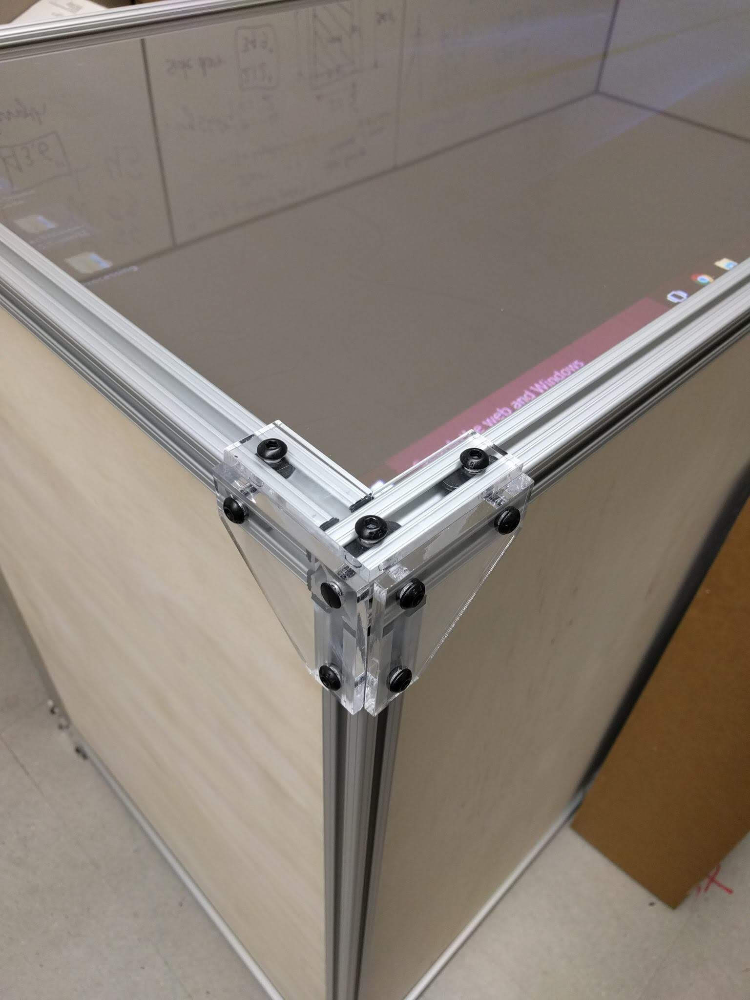
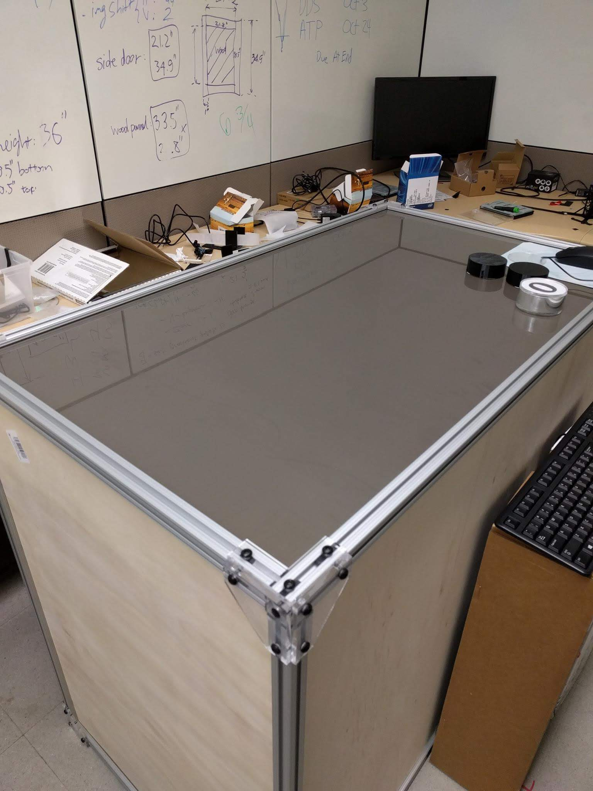
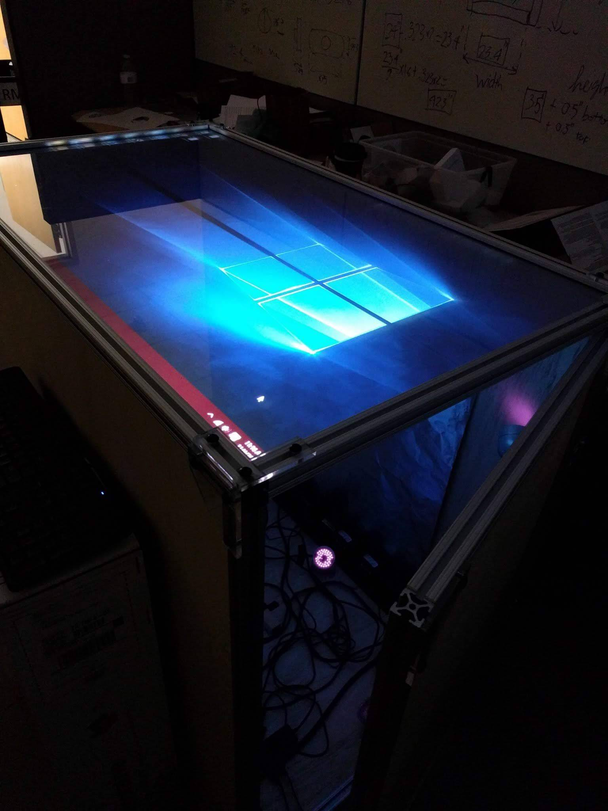
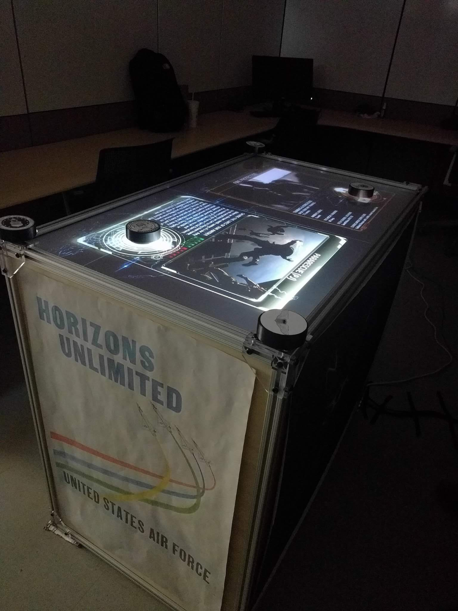
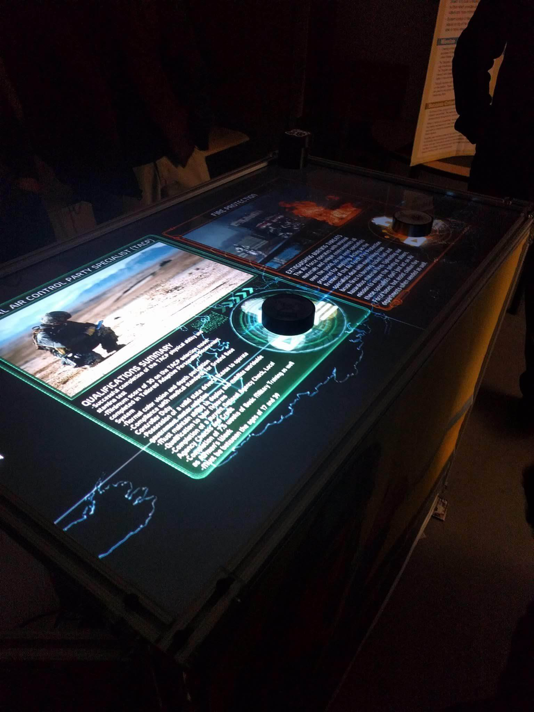
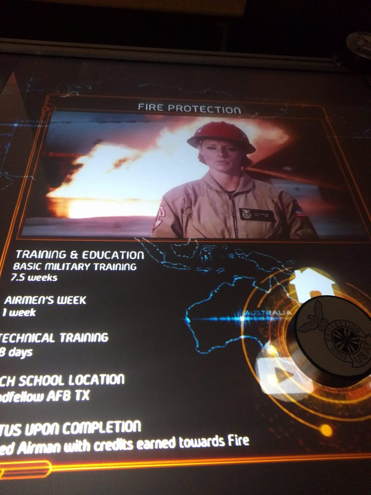
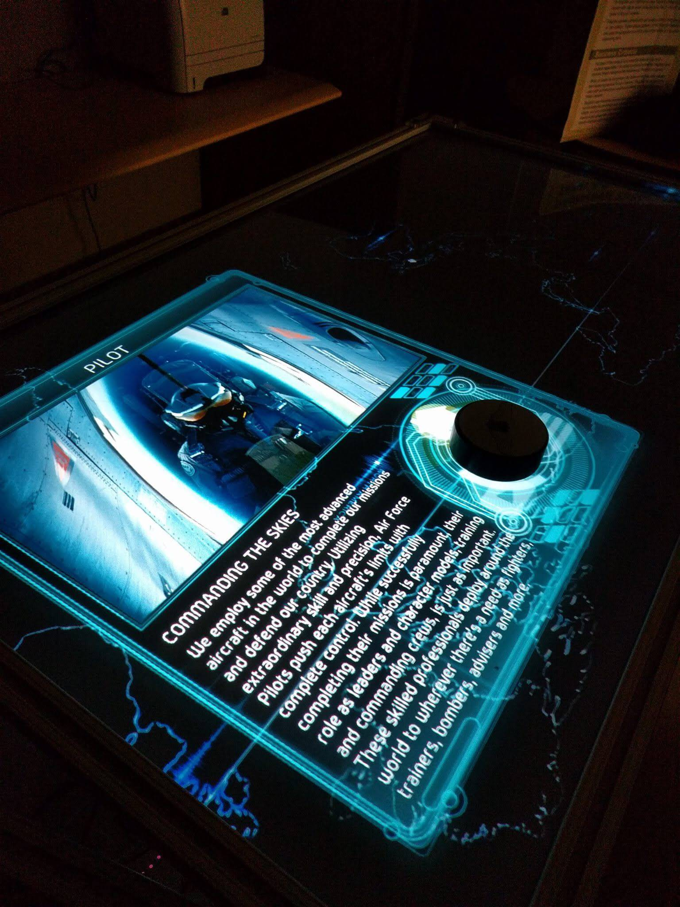
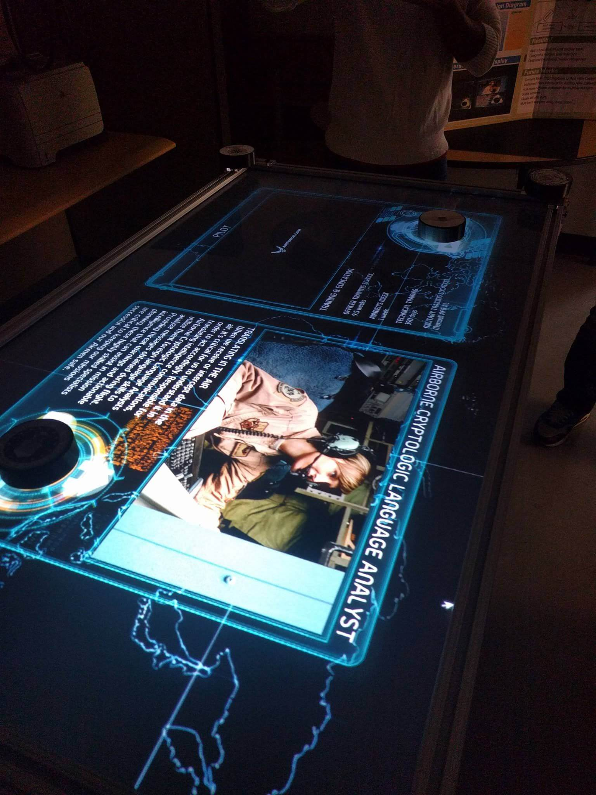
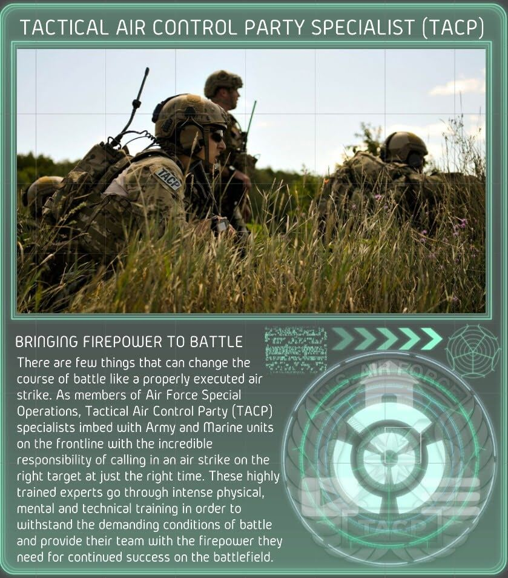
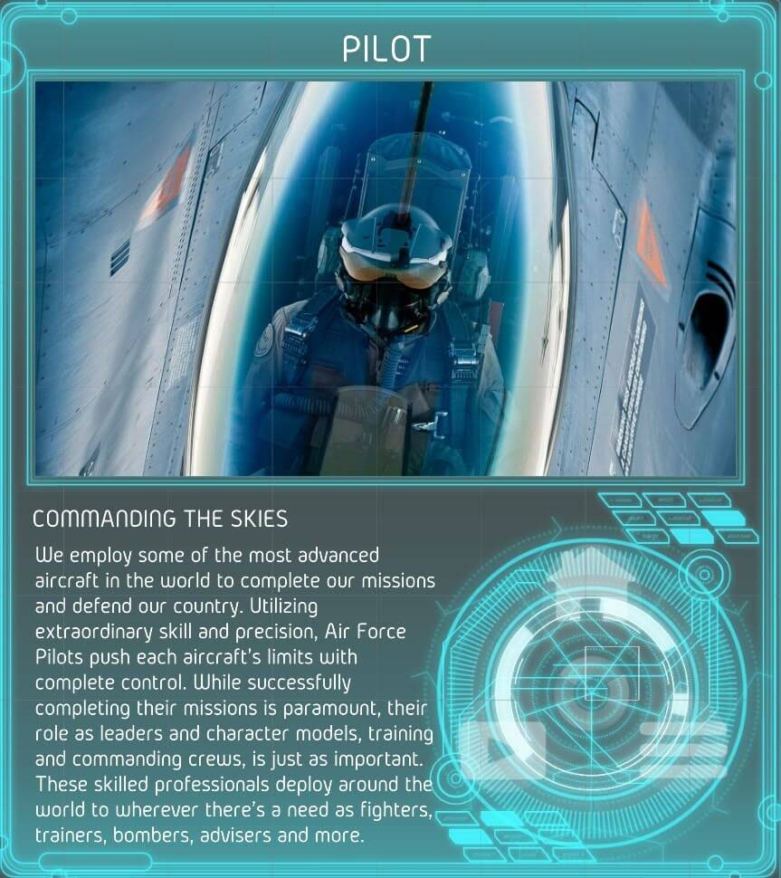
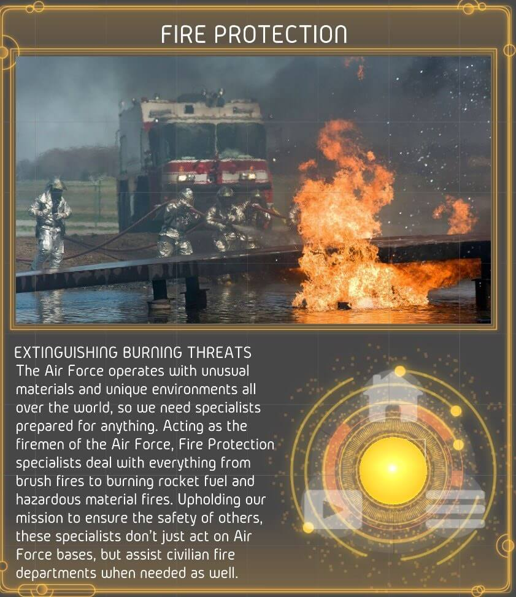
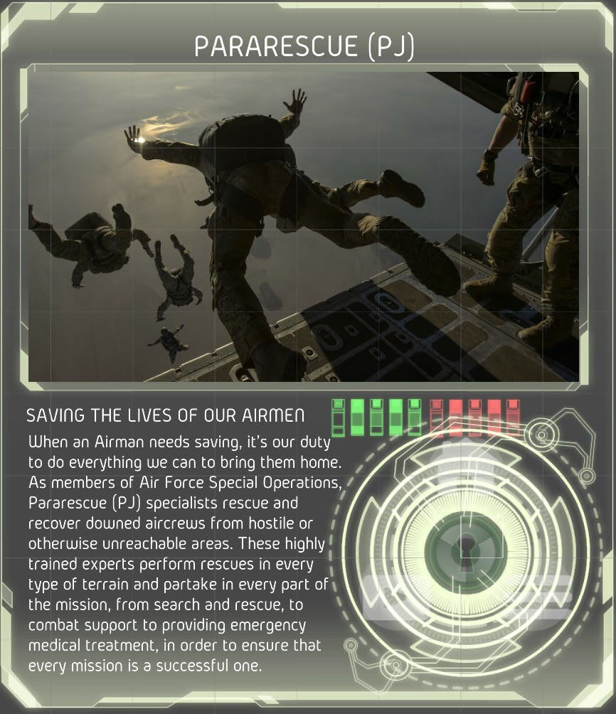

